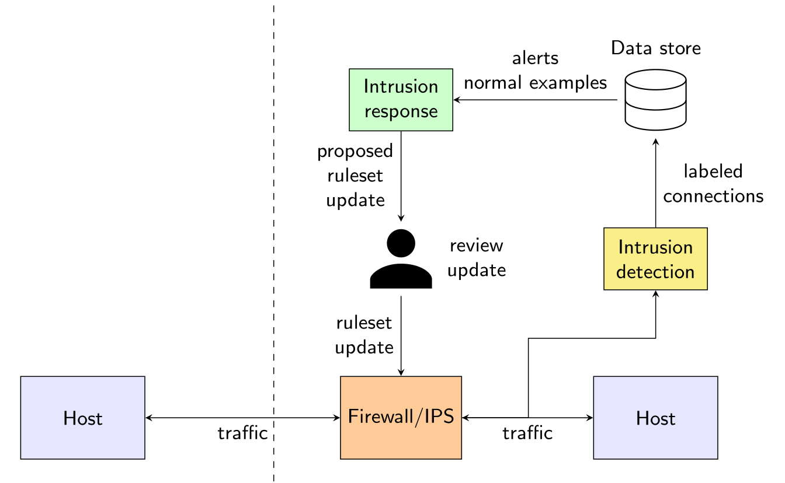

# Network Intrusion Response Systems (NIRS)

This code allows to evaluate Network Intrusion Response Systems based on iptables rules.
A Network Intrusion Response Systems (NIRS) uses alerts from Network Intrusion Detection
Systems (NIDS) to dynamically generate firewall rules. 




## Reproducing paper results

As this is a living repository, we create separate branches to have permanent code snapshots for each paper.

- ANUBIS 2025 paper: [Network Intrusion Response Systems: Towards standardized evaluation of intrusion response](https://hal.science/hal-05294762v1). Code: [link](https://github.com/thomasmarchioro3/NIRS/tree/anubis2025)

- WAITI 2025 paper: AgentNIRS: An LLM-Driven Agent for Network Intrusion Response. Code: [link](https://github.com/thomasmarchioro3/NIRS/tree/waiti2025)


## Create and evaluate a custom NIRS

Create a NIRS class by extending the BaseNIRS class:

```python
import numpy as np
import polars as pl
from nirs import BaseNIRS

class MyNIRS(BaseNIRS):

    def __init__(self, ...) -> None:
        # implement constructor

    def apply_rules(self, X: pl.DataFrame) -> np.ndarray:
        # implement the logic for applying firewall rules to network flows
        # to a DataFrame of network flows (this function should return the
        # indexes of the blocked flows)
        idx_blocked = ...
        return idx_blocked

    def update(self, df: pl.DataFrame) -> None:
        # implement your logic for ingesting a DataFrame of network flows
        # and updating the firewall rules

my_nirs = MyNIRS(...)
```

and evaluate it using the `eval_nirs` function.

```python
from nirs.eval import eval_nirs

df = ...  # Polars DataFrame of labeled network flows 

eval_nirs(
    df = df,
    nirs = my_nirs,
    update_time_ms = 30_000,  # call my_nirs.update(...) every 30s, tweak this value depending on your use case
    seed = 42,
)
```

## Run the code

#### Using a Python virtual environment or Conda environment

1) Activate the environment: you should see `(env_name)` on your shell.

2) Install dependencies

```sh
pip install -r requirements.txt
```

3) Run scripts as modules as specified in their description.
For example, to run `experiments/run_nirs.py`

```sh
python -m experiments.run_nirs --help
```

#### Using uv

1) Install [uv](https://github.com/astral-sh/uv)

```sh
curl -LsSf https://astral.sh/uv/install.sh | sh
```

2) Install dependencies

```sh
uv sync
```

3) Run scripts as modules (replace `python` with `uv run`)
For example, to run `experiments/run_nirs.py`

```sh
uv run -m experiments.run_nirs --help
```

## Cite this project

```bibtex
@inproceedings{marchioro2025network,
  title={Network Intrusion Response Systems: Towards standardized evaluation of intrusion response},
  author={Marchioro, Thomas and Saroui, Rachida and Olivereau, Alexis},
  booktitle={International Workshop on Assessment with New methodologies, Unified Benchmarks, and environments, of Intrusion detection and response Systems},
  pages={},
  year={2025},
  organization={Springer}
}
```
